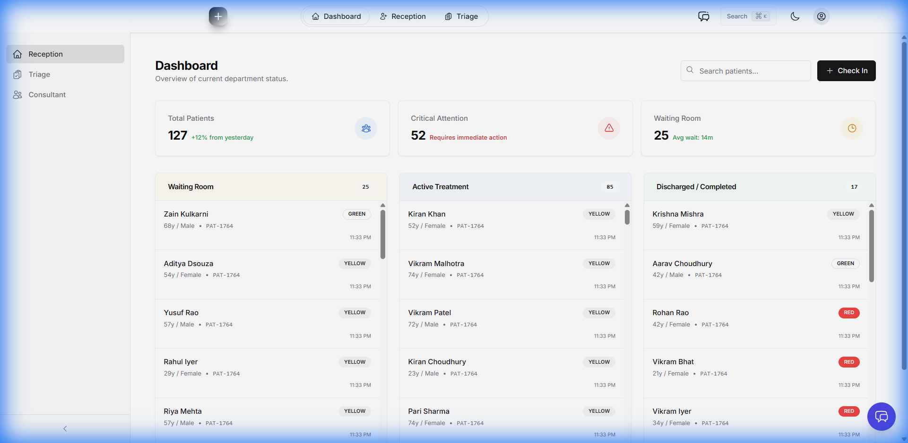
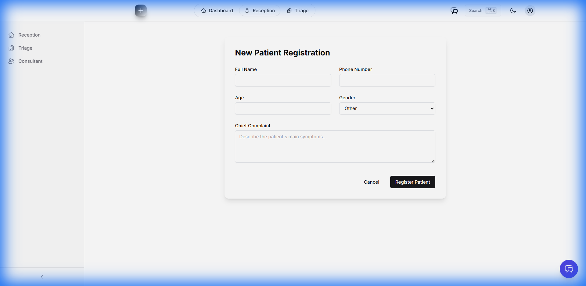
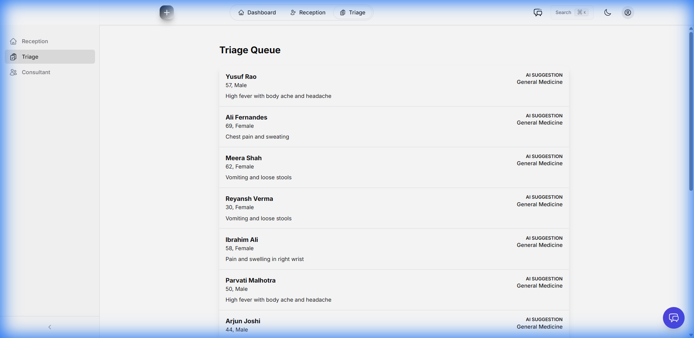
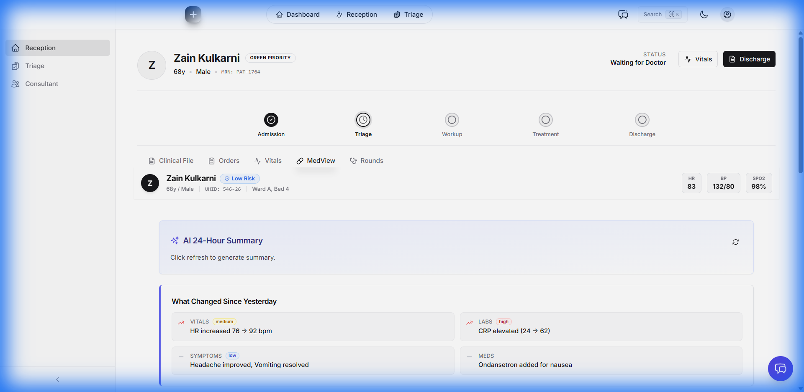
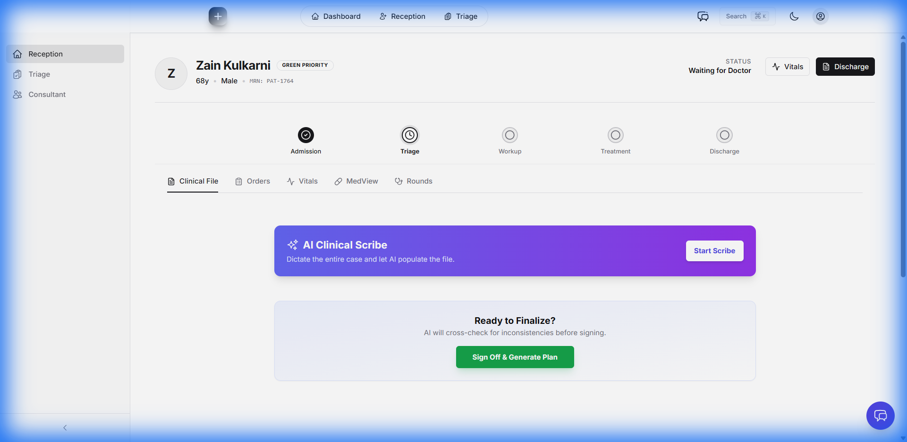

# MedFlow AI - Design Review Report

## Executive Summary
This report provides a comprehensive design audit of the MedFlow AI application in its current state (Standard shadcn/ui Theme). The review focuses on **Design Uniformity** (consistency in visual elements) and **Design Psychology** (usability, trust, and cognitive load).

## 1. Methodology
- **Scope**: All major application views (Dashboard, Patient View, Consultant, Reception, Triage).
- **Criteria**:
    - **Uniformity**: Consistency in typography, color palette, spacing, and component usage.
    - **Psychology**: Information hierarchy, cognitive load, affordance, and "clinical trust" factor.

## 2. Page-by-Page Analysis

### 2.1 Dashboard (Home)

- **Uniformity**: Consistent use of the card component for patient lists and stats. Navigation sidebar matches the global theme.
- **Psychology**:
    - **Cognitive Load**: Low. The layout is clean with clear separation between the sidebar and main content.
    - **Hierarchy**: Key metrics are placed at the top (if present), followed by the patient list, which is the primary action area.

### 2.2 Reception View

- **Uniformity**: Form inputs follow standard shadcn/ui styling (clean borders, focus states).
- **Psychology**:
    - **Efficiency**: The linear layout of the form encourages sequential data entry, reducing error rates.
    - **Clarity**: Labels are clear and positioned above inputs for quick scanning.

### 2.3 Triage View

- **Uniformity**: Consistent with Reception view. Uses the same table/list structure for patient queue.
- **Psychology**:
    - **Urgency**: The list format allows for quick assessment of waiting patients.
    - **Action-Oriented**: Clear "Admit" or "Process" buttons (if visible) guide the user to the next step.

### 2.4 Patient View (MedView)

- **Uniformity**: Maintains the sidebar and header consistency. Cards are used to group related clinical data (Vitals, History).
- **Psychology**:
    - **Information Density**: High, but managed via card grouping.
    - **Trust**: The clean, white-background aesthetic conveys sterility and precision, essential for medical data.

### 2.5 Clinical File & AI Scribe

- **Uniformity**: The AI Scribe section uses the same button and text input styling as the rest of the app.
- **Psychology**:
    - **Integration**: The AI feature is embedded within the clinical workflow, not floating as a distraction.
    - **Control**: The "Start Scribe" button gives the user explicit control, fostering trust in the AI tool.

## 3. General Findings
### Strengths
- **Consistency**: The application strictly follows the shadcn/ui design system, ensuring high uniformity in fonts (Inter), colors (Slate/Zinc), and component behavior.
- **Readability**: High contrast (black text on white background) ensures excellent readability in various lighting conditions.
- **Predictability**: Navigation and interaction patterns are standard, reducing the learning curve.

### Weaknesses / Opportunities
- **Visual Hierarchy**: Some pages might benefit from more distinct section headers to break up large white areas.
- **Feedback**: Ensure all AI actions provide immediate visual feedback (spinners, toasts) to maintain user confidence.

## 4. Recommendations
1.  **Maintain Standard Theme**: The current revert has successfully restored a clean, professional medical look. Stick to this design system to ensure long-term consistency.
2.  **Enhance AI Feedback**: As AI features grow, ensure they always signal "working" states clearly to avoid user uncertainty.
3.  **Accessibility Check**: Continue to verify contrast ratios and aria-labels, especially for dynamic AI-generated content.
